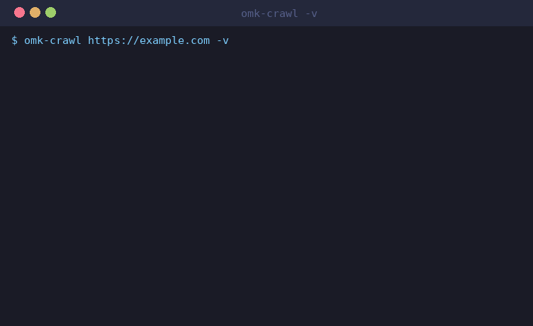
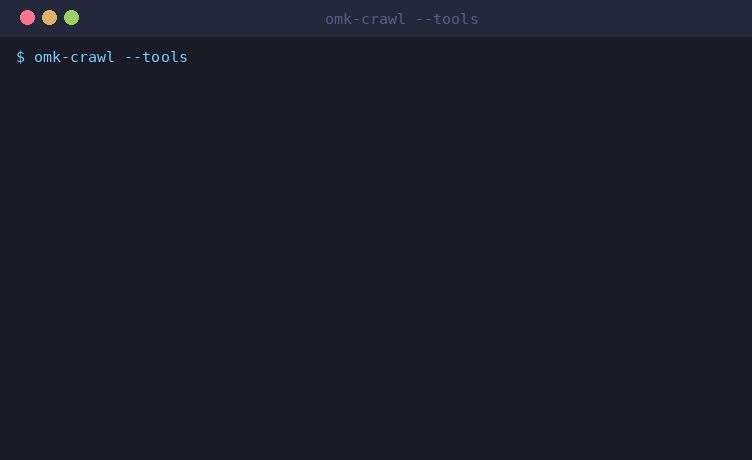
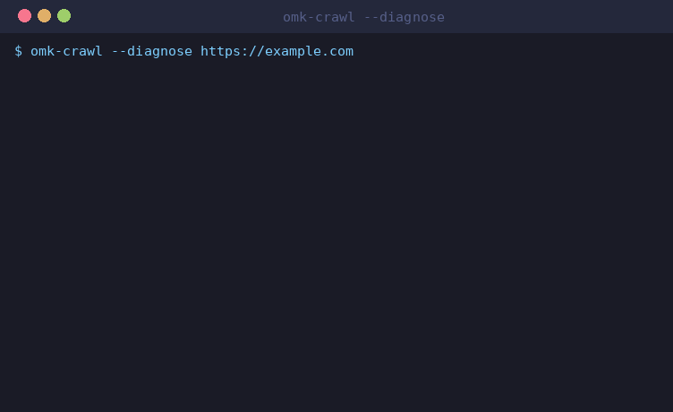
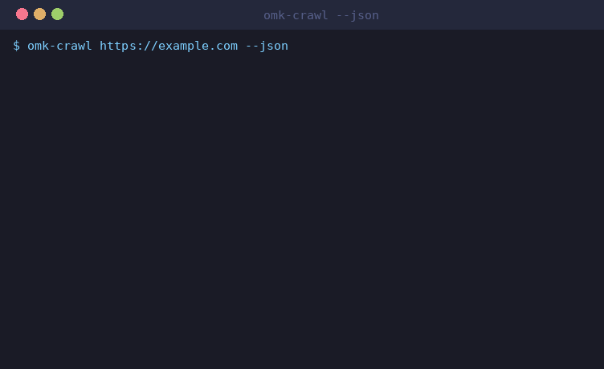
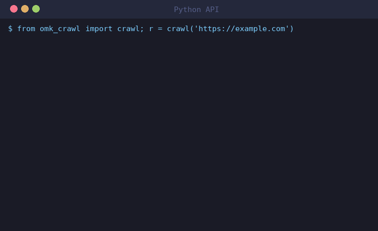
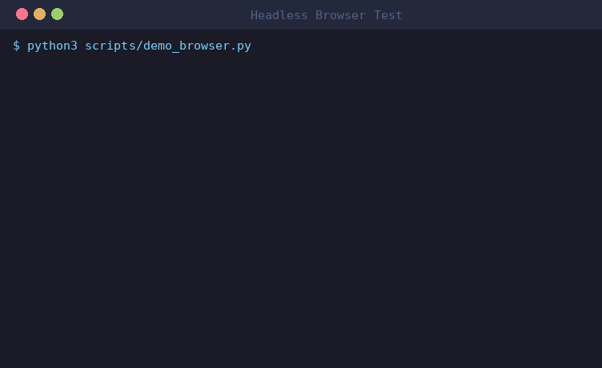

<p align="center">
  
</p>

<h1 align="center">omk-crawling</h1>

<p align="center">
  <strong>Smart web crawling toolbox — 6 adapters, one router.</strong><br/>
  Fetch → Crawl → Browser → Extract → Convert → Mobile. Auto-escalates until it works.
</p>

<p align="center">
  <a href="https://github.com/dmae97/omk-crawling/blob/main/LICENSE.txt"></a>
  
  
  
</p>

<p align="center">
  <a href="https://github.com/dmae97/omk-crawling/stargazers"></a>
  <a href="https://github.com/dmae97/omk-crawling/network/members"></a>
  <a href="https://github.com/dmae97/omk-crawling/issues"></a>
</p>

<p align="center">
  <code>omk-crawl https://example.com</code> — one command. TLS detection → auto-escalation → unified result.
</p>

---

## Demo

### 1. Auto-Escalation (verbose)

<p align="center">
  
</p>

### 2. Tool Discovery

<p align="center">
  
</p>

### 3. Diagnose (dry-run)

<p align="center">
  
</p>

### 4. JSON Output

<p align="center">
  
</p>

### 5. Python API

<p align="center">
  
</p>

### 6. Headless Browser Test (Playwright + Chrome)

<p align="center">
  
</p>

---

## Why omk-crawling?

Web crawling never ends with one tool. A site might block your TLS fingerprint, require JS rendering,
hide behind Cloudflare, or need a full LLM agent to navigate a login flow. **omk-crawling routes
across 6 adapters automatically** (4 in the escalation chain), escalating from the lightest to the heaviest until the data is yours.

```
curl_cffi (0ms browser) → crawl4ai (render) → scrapling (stealth) → browser-use (LLM agent)
```

---

## Architecture

```
                    ┌─────────────────────────────────────────┐
                    │            SmartRouter                   │
                    │  detect → route → escalate → result     │
                    └──────────┬──────────────────────────────┘
                               │
          ┌────────────────────┼────────────────────┐
          ▼                    ▼                    ▼
   ① curl_cffi          ② crawl4ai          ③ scrapling
   TLS/JA3 spoof        browser render      stealth browser
   0ms browser           + Markdown          + anti-bot bypass
          │                    │                    │
          └────────────────────┼────────────────────┘
                               ▼ (still blocked?)
                        ④ browser-use
                        LLM agent drives browser
                               │
                               ▼
                        CrawlResult (unified)
                        .markdown .html .extracted
```

---

## Install

### As OMK Skill (git clone + one-liner)

```bash
git clone https://github.com/dmae97/omk-crawling.git
cd omk-crawling
./install.sh              # symlink (dev mode, edits reflect instantly)
./install.sh --copy       # stable copy
./install.sh --uninstall  # remove
```

### As Python Package

```bash
pip install git+https://github.com/dmae97/omk-crawling.git              # core (zero-dep router + CLI)
pip install "git+https://github.com/dmae97/omk-crawling.git#egg=omk-crawl[curl]"        # + curl_cffi (TLS fingerprint)
pip install "git+https://github.com/dmae97/omk-crawling.git#egg=omk-crawl[crawl4ai]"    # + crawl4ai (browser + markdown)
pip install "git+https://github.com/dmae97/omk-crawling.git#egg=omk-crawl[scrapling]"   # + scrapling (stealth)
pip install "git+https://github.com/dmae97/omk-crawling.git#egg=omk-crawl[browser]"     # + browser-use (LLM agent)
pip install "git+https://github.com/dmae97/omk-crawling.git#egg=omk-crawl[all]"         # everything
```

---

## Quick Start

### CLI

```bash
omk-crawl https://example.com                    # auto-escalate
omk-crawl https://example.com --tool curl_cffi   # force specific tool
omk-crawl https://example.com -o out.md          # save markdown to file
omk-crawl https://example.com --json             # JSON output
omk-crawl https://example.com -v                 # verbose escalation log
omk-crawl https://example.com --no-robots         # skip robots.txt check
omk-crawl https://example.com --min-delay 2.0     # 2s between same-domain requests
omk-crawl --diagnose https://example.com         # dry-run: what would we try?
omk-crawl --tools                                # list installed/missing tools
omk-crawl report.pdf                             # file → markdown (markitdown)
```

### Python

```python
from omk_crawl import crawl

# One-liner with auto-escalation
r = crawl("https://example.com")
print(r.markdown)       # LLM-ready markdown
print(r.summary())      # [ok] https://example.com | via curl_cffi | HTTP 200 | 42ms

# Verbose escalation
r = crawl("https://protected-site.com", verbose=True)
#   [omk-crawl] [1/4] Trying curl_cffi...
#   [omk-crawl]   ✗ curl_cffi: blocked — TLS fingerprint block
#   [omk-crawl] [2/4] Trying crawl4ai...
#   [omk-crawl]   ✓ crawl4ai succeeded (1204ms)
```

### Pipeline

```python
from omk_crawl.pipeline import Pipeline

result = (
    Pipeline()
    .fetch()
    .extract_css("div.product", {"title": "h2", "price": ".price"})
    .to_markdown()
    .run("https://shop.example.com")
)
print(result.extracted)  # [{"title": "...", "price": "..."}]
```

### Async

```python
import asyncio
from omk_crawl import crawl_async

async def main():
    r = await crawl_async("https://example.com")
    print(r.markdown)

asyncio.run(main())
```

---

## Tool Router

**6 runtime adapters** — 4 core in the auto-escalation chain (curl_cffi → crawl4ai → scrapling → browser-use) plus 2 auxiliary (autoscraper, markitdown). The skill *catalog* references 10 tools overall; the remainder (scrapy, crawlee, scrcpy, curl-impersonate, insane-search) are documented in [`references/`](references/) for manual use, not wired into the router.

| Need | Tool | Layer | Status |
|------|------|-------|
| Single blocked URL (403/WAF) | `insane-search` | ① Fetch | documented |
| TLS/JA3 fingerprint block | `curl-impersonate` / `curl_cffi` | ① Fetch | **adapter** |
| Anti-bot stealth + Cloudflare | `scrapling` | ① Fetch | **adapter** |
| Large-scale classic crawl | `scrapy` | ② Crawl | documented |
| Queue · auto-scale · proxy | `crawlee` | ② Crawl | documented |
| Web → LLM Markdown · deep crawl · MCP | `crawl4ai` | ② Crawl | **adapter** |
| LLM agent drives browser | `browser-use` | ③ Browser | **adapter** |
| Learn extraction from examples | `autoscraper` | ④ Extract | **adapter** |
| PDF/Office/image/audio → Markdown | `markitdown` | ⑤ Convert | **adapter** |
| Android-only data | `scrcpy` | ⑥ Mobile | documented |

Full decision tree: [`references/routing.md`](references/routing.md)

---

## Benchmarks

The router is measured against a 20-site set spanning four difficulty tiers
(static, JS/SPA, soft bot-wall, hard CF/WAF) in [`benchmarks/sites.yaml`](benchmarks/sites.yaml).
Metrics: **success@1** (first tool, no escalation), **success@final** (any tool),
**p50/p95 latency**, content **bytes**, the **tool path** actually tried, and a
**cost proxy** (how many browser/LLM-tier tools escalation invoked).

Live run, polite subset (scrape-friendly sites only, `robots.txt` respected,
≥1 s between requests), zero-dep install (curl_cffi):

| site | category | ok@1 | ok@final | p50 ms | p95 ms | KB | tool path | cost |
|------|----------|:----:|:--------:|-------:|-------:|---:|-----------|:----:|
| example.com | static | ✓ | ✓ | 661 | 917 | 0 | curl_cffi | 0 |
| httpbin-html | static | ✓ | ✓ | 1318 | 1542 | 3 | curl_cffi | 0 |
| books.toscrape | static | ✓ | ✓ | 1577 | 1944 | 10 | curl_cffi | 0 |
| quotes.toscrape | static | ✓ | ✓ | 1277 | 1595 | 2 | curl_cffi | 0 |
| info.cern | static | ✓ | ✓ | 1666 | 2150 | 0 | curl_cffi | 0 |
| quotes-js | js | ✓ | ✓ | 894 | 997 | 0 | curl_cffi | 0 |
| httpbin-root | js | ✓ | ✓ | 857 | 978 | 0 | curl_cffi | 0 |

**success@1 7/7 · success@final 7/7.** Note the JS rows return HTTP 200 but ~0 KB
of usable content with curl_cffi alone — exactly the case where installing a
renderer (`pip install omk-crawl[crawl4ai]`) lets the router escalate to real
content. The hard CF/WAF tier is exercised by the nightly live benchmark only.

```bash
python scripts/bench.py --mock                              # CI: synthetic, no network
python scripts/bench.py --category static,js --live-only --runs 2   # polite live
python scripts/bench.py --runs 3                            # full set (use responsibly)
```

Results are written to `benchmarks/latest.json`.

---

## Repo Structure

```
omk_crawl/              # Python package
  __init__.py           # Public API: crawl(), CrawlResult
  router.py             # SmartRouter — auto-detect + escalate
  detect.py             # Block detection (TLS, CF, JS, WAF)
  result.py             # Unified CrawlResult dataclass
  pipeline.py           # Composable fetch → extract → convert
  cli.py                # CLI entry point (omk-crawl)
  tools/                # Tool adapters (6 adapters)
tests/                  # pytest suite
references/             # Per-tool reference docs (14 files)
examples/               # Runnable examples (7 files)
scripts/                # check-versions.sh
assets/                 # Hero image
SKILL.md                # OMK skill definition
NOTICE.md               # Licenses + shoutouts to all 11 projects
install.sh              # One-liner skill installer
```

---

## Development

```bash
pip install -e ".[all,dev]"
pytest tests/ -v                    # run tests
bash scripts/check-versions.sh      # upstream version drift
ruff check omk_crawl/               # lint
```

---

## Shoutouts 🙏

Built on the shoulders of 11 amazing projects. See [NOTICE.md](NOTICE.md) for full attribution.

| # | Project | License | What it does |
|---|---------|---------|--------------|
| 1 | [crawl4ai](https://github.com/unclecode/crawl4ai) | Apache-2.0 | LLM-first web crawler |
| 2 | [scrapy](https://github.com/scrapy/scrapy) | BSD-3-Clause | Mature crawl framework |
| 3 | [crawlee](https://github.com/apify/crawlee) | Apache-2.0 | Production crawl infra |
| 4 | [browser-use](https://github.com/browser-use/browser-use) | MIT | LLM browser agent |
| 5 | [curl-impersonate](https://github.com/lwthiker/curl-impersonate) | MIT | TLS fingerprint bypass |
| 6 | [curl_cffi](https://github.com/lexiforest/curl_cffi) | MIT | Python curl-impersonate |
| 7 | [autoscraper](https://github.com/alirezamika/autoscraper) | MIT | Example-based extraction |
| 8 | [markitdown](https://github.com/microsoft/markitdown) | MIT | File → Markdown |
| 9 | [scrcpy](https://github.com/Genymobile/scrcpy) | Apache-2.0 | Android mirror/control |
| 10 | [scrapling](https://github.com/d4vinci/Scrapling) | BSD-3-Clause | Stealth scraping |
| 11 | [insane-search](https://github.com/fivetaku/gptaku_plugins) | GPTaku | Auto-bypass blocked sites (by **fivetaku**) |

---

## License

Apache-2.0. See [LICENSE.txt](LICENSE.txt) and [NOTICE.md](NOTICE.md).

## Responsible Use

This toolbox includes TLS fingerprint impersonation and anti-bot bypass capabilities. Use responsibly:

- **Respect robots.txt** and site Terms of Service before crawling.
- **Rate-limit your requests** — don't overwhelm target servers.
- **Only crawl data you're authorized to access.** Bypassing authentication or accessing protected data without permission may violate laws (CFAA, GDPR, etc.).
- These tools are intended for legitimate research, development, and data extraction within legal boundaries.

> This product includes software developed by UncleCode (https://x.com/unclecode)
> as part of the Crawl4AI project (https://github.com/unclecode/crawl4ai).

---

## Star History

<p align="center">
  <a href="https://star-history.com/#dmae97/omk-crawling&Date">
    <picture>
      <source media="(prefers-color-scheme: dark)" srcset="https://api.star-history.com/svg?repos=dmae97/omk-crawling&type=Date&theme=dark" />
      <source media="(prefers-color-scheme: light)" srcset="https://api.star-history.com/svg?repos=dmae97/omk-crawling&type=Date" />
      
    </picture>
  </a>
</p>

---

<p align="center">
  <sub>Built with 💜 in the Night City · OMK//CONTROL · 2026</sub>
</p>
